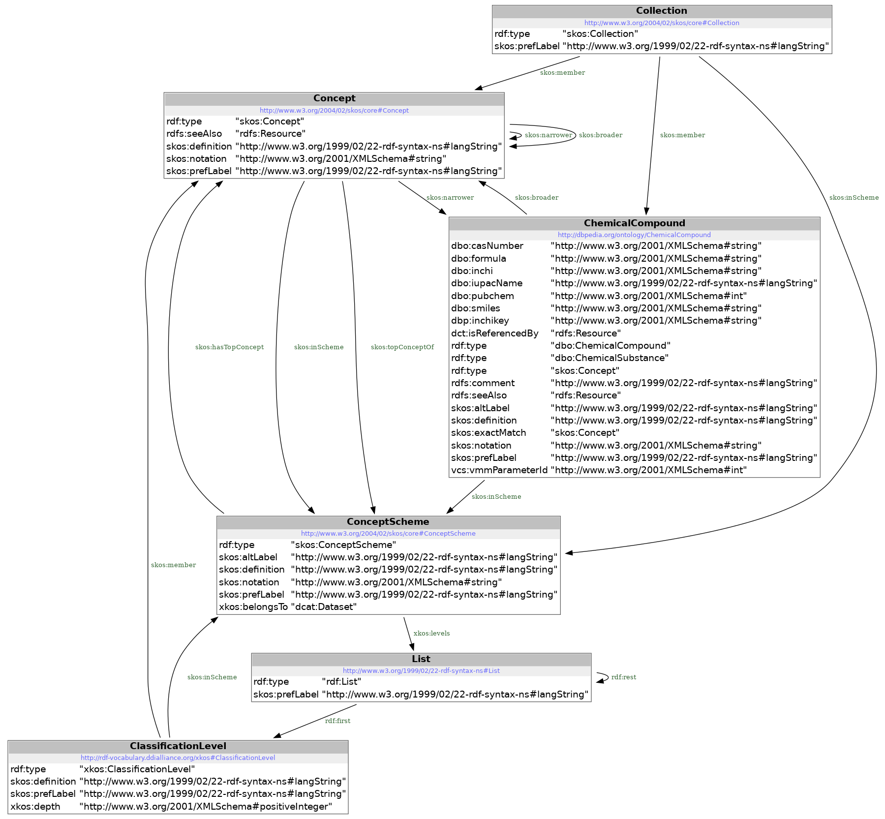

# codelijst-chemische_stof

## Samenvatting

Dit project bevat een codelijst met eenduidige benamingen van chemische stoffen en tools om deze lijst te beheren en om te zetten naar webformaten.

## Model

## Gebruik

- Voeg een definitie van een nieuwe chemische stof toe aan $PROJECT_HOME/src/main/resources/be/vlaanderen/omgeving/data/id/conceptscheme/chemische_stof/chemische_stof.csv


### Voer het het transformatiescript uit:
```
cd $PROJECT_HOME/src/
node 01_codelijst_skos_from_csv.js
```

### run een maven build ( testen worden uitgevoerd en metadata aangemaakt)
```
cd $PROJECT_HOME
mvn clean install
```

## Dependencies

**_nodejs_**

### Installeer nodejs en npm
```
apt-get install node
apt-get install npm
```

### Installeer libraries in package.json
```
cd $PROJECT_HOME
/usr/bin/node /usr/lib/node_modules/npm/bin/npm-cli.js install --scripts-prepend-node-path=auto
```